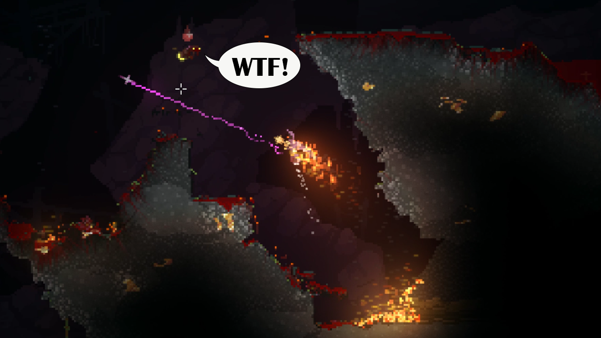

# Healing Flames

With Healing Flames, fire heals all wounds. The challenge with this new power is staying lit.
Soaked cloaks are hard to burn, so try to keep dry (the perk that freezes all liquids can be
helpful). Healing Flames also removes the protection from fire perk, which would prevent
ignition if acquired. Adjust healing rate in settings. Adjustments take effect upon game start/
restart. Beware, contact with explosions and lava still hurts!

